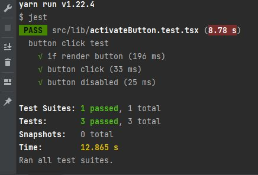

### 배경
golang 으로 api 개발을 할 때 테스트 케이스를 작성한다
react 로 어드민을 개발했었지만 testcase 를 어떻게 하는지 몰랐다
그래서 npm 모듈을 만드는 과정에서 간단하게
테스트 환경을 구성하고 버튼을 테스트 해보려고 했다
그과정에서 발생했던 오류나 설치했던 내용을 정리하려고 한다


### React test 라이브러리

jsdom 라이브러리를 통해 실제 브라우저 DOM 을
기준으로 테스트를 작성합니다.
사용자 브라우저에 렌더링하는 실제 모습이 어떤지 테스트함
(설치)`npm i -D @testing-library/react`

* 주요 API
    * `render()`
    * `fireEvent :선택된 영역이 특정 이벤트를 발생시키기 위한 이벤트 함수`
    * `screen`

```
import {fireEvent,screen, render} from '@testing-library/react';

render(<ActivateButton
 title={'Click'}
    ...
/>);

const button = screen.getByRole('button', {name: 'Click'});
fireEvent.click(button)
```

(참고)
`import userEvent from '@testing-library/user-event';`
`userEvent.click(button)`


# [react testing library](https://testing-library.com) 로 dom 을 렌더링 한다

* create react app 으로 생성된 프로젝트는 테스트 라이브러리를 지원하여 설치하지 않아도 사용 할 수 있다.
추가적으로 설치시 `npm install --save-dev @testing-library/react`로 설치
* 행위 주도 테스트 입니다. 구현된 내부 보다 잘 동작되는지 확인

* dom ?
=xml,html 문서의 각 항목을 계층으로 표현하여 생성,변형 삭제할 수 있도록 돕는 인터페이스?
= html 이 브라우저의 렌더링 엔진에 의해 분석되고 분석이 끝난 html 파일
* 웹 페이지 빌드 과정(crp) = 웹 브라우저가 html 문서를 읽고,스타일 입히고 뷰포트에 표시하는 과정

# 렌더링 된 dom 을 jest 를 이용해서 테스트

* jest = 테스팅 프레임 워크 = 단위 테스트를 위해 이용
= 최소한의 설정으로 동작하며 테스트 케이스를 만들어서 어플리케아션 코드가 잘 동작하는지 확인
* create react app 으로 생성된 프로젝트는 테스트 라이브러리를 지원하여 설치하지 않아도 사용 할 수 있다.
* 설치 :`npm install jest -save-dev`

# jest 가 파일을 어떻게 찾나요?
```
1. (fileName).test.js
2. (fileName).spec.js
3. tests 폴더 생성시 안에 파일을 테스트 케이스로 인식
```
react 프로젝트의 터미널에서 `npm test` 입력 실행 시 위 3가지 경우에 해당하는 파일들을 찾아 테스트함


# testing 예시
```
describe("name", () =>{ //테스트 그룹화
    it("name",()=>{
            ...    개별 테스트 수행

        expect( 실행 코드 ).toBe()
        //expect = 값을 테스트시 사용하며  matcher 랑 사용
        // toBe ,toEqual 등 다양한 matcher 존재
    })
    test("name",()=>{
            ...    개별 테스트 수행
    })
    // it = test
})
```

```
render(<Test/>) //`<Test/>` 컴포넌트를 렌더링 = dom의 컴포넌트를 렌터링 하는 함수
const element = screen.getByText("test") // test 텍스트를 갖은 요소를 찾음
expect(element).toBeInTheDocument()// 렌더링하여 컴포넌트 존재 여부 확인
```
=> [다양한 커스텀 함수들에 대한 설명](https://testing-library.com/docs/ecosystem-jest-dom/)

# query 함수  = 페이지에서 요소를 찾기 위한 함수


### Jest
React 의 테스팅 프레임워크 Jest
(설치) `npm i -D jest`
(package.json 에 script 추가)
```
    "scripts": {
        "test": "jest"
        ...
    },

```

* `describe() : test 그룹화`
* `it():  should do this thing`
* `test(): if it does this thing`

### 테스팅 설정 파일 src/setupTests.js 설정 ?

1. setupTests.js 설정 안했다면  상단에 import

    `expect(button).toHaveProperty('disabled',false)`등 expect 를 사용했는데
    테스팅 설정 파일 없고  import 안해서 error 발생 했다.
    ```
    expect(...).toHaveAttribute is not a function
     TypeError: expect(...).toHaveAttribute is not a function
    -> The method toHaveAttribute is part of jest-dom
    ```
    `import "@testing-library/jest-dom/extend-expect";` 상단에 import 추가하니 해결됨

    * expect(button).toHaveProperty('disabled',false)
    * expect(button).toBeInTheDocument();

2. setupTests.js 설정

    `src/setupTests.js` 추가하고 `import '@testing-library/jest-dom` 추가함
    (package.json) 에 script 에 `"test": "jest"` 실행시 jest-dom 못찾는다면
    `"test2": "react-scripts test"` script 를 추가하고 실행
    [setupTests.js not loading automatically in CRA react app](https://stackoverflow.com/questions/53642594/setuptests-js-not-loading-automatically-in-cra-react-app)

(jest.config.js 에 setupFilesAfterEnv 추가)
```
module.exports = {
...
  setupFilesAfterEnv: ["<rootDir>/src/setupTests.js"],
};

```

### [If you're using Jest 28 or later, jest-environment-jsdom package now must be installed separatel](https://testing-library.com/docs/react-testing-library/setup/#jest-28)
(설치)`yarn add --dev jest-environment-jsdom`
(jest.config.js 에 jsdom 추가)
```
 module.exports = {
+  testEnvironment: 'jsdom',
   // ... other options ...
 }
```

나는 이 부분을 몰라서 `TypeError: Cannot read properties of undefined (reading 'html')`
에러가 났었고 [검색](https://github.com/facebook/jest/issues/12200#issuecomment-1004169335)
해서 jest-environment-jsdom 을 추가해야 한다는 것을 알게되었다


###   unexpected token syntax error + import ... style.css 에서 에러 발생
스타일 시트를 import하는 부분에서 jest가 코드를 로딩함
이 부분을 mock 으로 치환한다
1. styleMock.ts 파일생성, 파일 안에 `export default {}` 추가
2. jest.config.js 에 moduleNameMapper 에 mock 로 치환해주는 코드 추가
```
module.exports = {
  ...
  moduleNameMapper:{
    "\\.(css|less)$": "<rootDir>/styleMock.ts"
  }
};
```


### typescript 에서 jest 를 사용하려면
(설치)`npm i jest @types/jest ts-jest typescript -D`
(jest.config.js)
```
module.exports = {
 ...
  testMatch: [
    '<rootDir>/**/*.test.(js|jsx|ts|tsx)',
    '<rootDir>/(tests/unit/**/*.spec.(js|jsx|ts|tsx)|**/__tests__/*.(js|jsx|ts|tsx))'
  ],
  transform: {
    "^.+\\.(ts|tsx)$": "ts-jest"
  },
    ...
};
```

(설치) `yarn add --dev @babel/preset-typescript`
(설치) `yarn add --dev babel-jest @babel/core @babel/preset-env`
(babel.config.js)
```
module.exports = {
    presets: [
        ['@babel/preset-env'],
    ],
};
```



### coverage 추가하기
https://www.daleseo.com/jest-coverage/


* uncaught referenceerror: react is not defined 에러 발생시
https://velog.io/@chloedev/webpack-uncaught-referenceerror-react-is-not-defined-t8zot8bu

classnames
https://chanhuiseok.github.io/posts/react-14/

test
https://hu-coding.tistory.com/96
https://react-hooks-testing-library.com/usage/basic-hooks

# 출처
https://stackoverflow.com/questions/39641068/jest-trying-to-parse-css
https://stackoverflow.com/questions/54627028/jest-unexpected-token-when-importing-css
https://create-react-app.dev/docs/running-tests/#react-testing-library
https://stackoverflow.com/questions/69227566/consider-using-the-jsdom-test-environment
https://velog.io/@velopert/react-testing-library
https://tecoble.techcourse.co.kr/post/2021-10-22-react-testing-library/
https://chinsun9.github.io/2021/08/07/start-jest-with-typescript/
https://jestjs.io/docs/getting-started#using-typescript
https://www.daleseo.com/react-testing-library/
https://stackoverflow.com/questions/65947682/expect-tohaveattribute-is-not-a-function-why