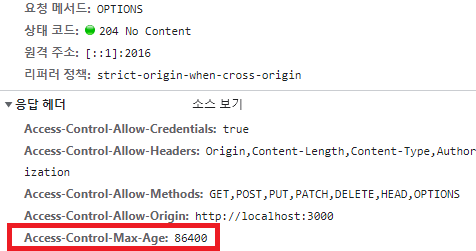

# 배경
오픈소스 프로젝트에 참가하게 되었고
그 프로젝트 이슈 중 한가지를 진행하기로 했다
담당한 이슈는 cors 정책을 지키지 못해서 발생한 문제로
cors 개념을 공부하고 기록하려고 한다.
최종적으로 cors 를 발생시키는 상황을 이해하고 테스트 코드를 작성하는 것이다.

### CORS 는 뭐고 탄생한 이유?
과거 모놀리식 아키텍쳐(Monolithic architecture) 에서는
클라이언트와 서버가 합쳐진 일체형 구조였다.
코드량이 늘어나고 규모가 커져서 관리하기 어려워 졌고 서바랑 클라이언트랑 분리하게 되었다
이때 웹 출처와 웹 서버의 출처가 달라지게 되는 경우도 많아졌다.


> 여기서 출처(Origin)가 뭐지?
URL 구조의 protocol ,hostname, port 를 합친 것을 말하며
보통 port 는 생략되어 보여도 값이 항상 존재한다
(URL 의 구조)
`[      http      ]://[www.test.org ]:[3000]/[main]? [ page=1]`
`[protocol(Scheme)]   [ host(domain)] [port] [path]  [query string]`


웹상에 리소스를 서로 주고 받으면서
요청을 제한하는 두가지 정책을 만들게 되었다.

> 1.SOP(Same-Origin Policy) 동일 출처 정책 : 같은 출처에서만 리소스를 공유할 수 있다
> 2.[Cross-Origin Resource Sharing (CORS)](https://developer.mozilla.org/en-US/docs/Web/HTTP/CORS)
> 다른 출처에 있는 리소스를 가져오는 것은 굉장히 흔한일로
> 몇 가지 예외 조항에 해당하는 리소스 요청은 출처가 다르더라도 허용하도록 했는데,
> 그 중 하나가 cors 정책을 지킨 리소스 요청이다.


정리하면
다른 출처로 리소스를 사용하는것은 SOP 위반
하지만 예외 조항에 해당하는 CORS 로 리소스 요청이 가능하게 되었는데
CORS 정책을 위반하게 되었을 때 에러가 발생한다.
(출처가 일치하지 않으 발생 URL 구조의 protocol ,hostname, port 중 하나라도 일치하지 않으면 발생)


### CORS 와 서버간의 관계는 뭐지?
서버 간 통신을 할 때는 이 정책이 적용되지 않는다
하지만
CORS에 정책은 서버에 저장되며
저장된 CORS 정책을 브라우저에 보내주는 일을 서버가 담당한다

서버에 입력된 출처와 다르면 리소스를 사용할 수 없도록 에러를 반환하고
검증된다면 허용해주는 응답 헤더를 보낸다.

즉 브라우저에게 http 요청이 발생하고 CORS 검증이 필요시
서버에게 Preflight Request(사전요청)을 한다
서버는 검증을 하고 문제가 있다면 http 요청을 취소시키고 에러를 발생시킨다

---

### [CORS 3가지 시나리오 체험 사이트](https://chuckchoiboi.github.io/cors-tutorial/)

>  simple Request
1. 서버가 응답 헤더 'Access-Control-Allow-Origin' 를 추가 안

```
	Access to fetch at 'https://cors-tutorial-server.herokuapp.com/api/simple/no-origin' from origin 'https://chuckchoiboi.github.io' has been blocked by CORS policy: No 'Access-Control-Allow-Origin' header is present on the requested resource. If an opaque response serves your needs, set the request mode to 'no-cors' to fetch the resource with CORS disabled.
```
	
2. 잘못된 출처로 요청을 보냈을 때(출처가 서버에 기록된 값과 다름)
```
	Access to fetch at 'https://cors-tutorial-server.herokuapp.com/api/simple/bad-origin' from origin 'https://chuckchoiboi.github.io' has been blocked by CORS policy: The 'Access-Control-Allow-Origin' header has a value 'https://www.website.notcool' that is not equal to the supplied origin. Have the server send the header with a valid value, or, if an opaque response serves your needs, set the request mode to 'no-cors' to fetch the resource with CORS disabled.
```
	
>  preflight request

1. 잘못된 출처로 요청을 보냈을 때(출처가 서버에 기록된 값과 다름)
2. "Access-Control-Allow-Methods" 을 지정하지 않았을 

```
Access to fetch at 'https://cors-tutorial-server.herokuapp.com/api/preflight/bad-method' from origin 'https://chuckchoiboi.github.io' has been blocked by CORS policy: Method DELETE is not allowed by Access-Control-Allow-Methods in preflight response.
```

3. preflight request 응답 헤더에는 제대로 작성했는데 
실제 simple rqeust 응답 헤더에 다른 출처를 작성
둘이 일치하지 않을떄? 제공된 오리진과 다른 경

```
Access to fetch at 'https://cors-tutorial-server.herokuapp.com/api/preflight/req-bad-origin' from origin 'https://chuckchoiboi.github.io' has been blocked by CORS policy: The 'Access-Control-Allow-Origin' header has a value 'https://www.website.notcool' that is not equal to the supplied origin. Have the server send the header with a valid value, or, if an opaque response serves your needs, set the request mode to 'no-cors' to fetch the resource with CORS disabled.
```

> credentialed request 인증과 관현된 정보를 담을 수 있게 해주는 옵션 :credentials 옵션

1. credentials 가 include 이어서 서버에서 "Access-Control-Allow-Origin" 값을  '*' 로 끌 수 없다
```
Access to fetch at 'https://cors-tutorial-server.herokuapp.com/api/credentialed/wildcard-origin' from origin 'https://chuckchoiboi.github.io' has been blocked by CORS policy: The value of the 'Access-Control-Allow-Origin' header in the response must not be the wildcard '*' when the request credentials mode is 'include'.
```

2. 서버의 응답헤더에 "Access-Control-Allow-Credentials" 값이 true 로 보내지 않았을 
```
Access to fetch at 'https://cors-tutorial-server.herokuapp.com/api/credentialed/good-origin' from origin 'https://chuckchoiboi.github.io' has been blocked by CORS policy: The value of the 'Access-Control-Allow-Credentials' header in the response is '' which must be 'true' when the request credentials mode is 'include'.
```

---

# [CORS preflight request Caching](https://developer.mozilla.org/en-US/docs/Glossary/Preflight_request)
`CORS Options Request 를 캐싱하여 HTTP Request 를 줄인다.`
실제로 오픈소스에 작업해보자

> [preflight 응답을 캐쉬하는 방법](https://news.hada.io/topic?id=7453)

# CORS preflight가 발생시키는 문제는 뭔가?


# 작업순서
현제 상태를 보니
기본 cors 설정을 하고 있지만
응답이 발생할 때 header 에 추가하는 코드가 없었다


브라우저 제한: Firefox는 값을 86400(24시간)으로 제한하는 반면
모든 Chromium 기반 브라우저는 값을 7200(2시간)으로 제한합니다.
모든 API 요청 전이 아니라 2시간마다 한 번씩 이 요청을 하면
사용자 경험이 크게 향상될 수 있으며
가능한 경우 더 긴 수명이 적용되도록 더 높은 값을 설정하는 것이 쉽게 승리할 수 있습니다.
https://httptoolkit.com/blog/cache-your-cors/


# 작업내용
처음에는 e.Use 에 미들웨어를 추가하고 테스트 케이스를 작성했다
```
	a.gin.Use(cors.New(a.newCorsConfig()))
	a.gin.Use(middlewares.CORSOptionsRequestCaching(a.newCorsConfig()))
```
```
func CORSOptionsRequestCaching(corsConfig cors.Config) gin.HandlerFunc {
	return func(c *gin.Context) {
		if c.Request.Method == "OPTIONS" {
			c.Writer.Header().Set("Access-Control-Max-Age", fmt.Sprintf("%v", corsConfig.MaxAge))
			c.JSON(http.StatusNoContent, "")
			return
		}
		c.Next()
	}
}
```
```
func TestCORSOptionsRequestCaching(t *testing.T) {
	// given
	router := gin.Default()
	corsConfig := cors.DefaultConfig()
	corsConfig.AllowCredentials = true
	corsConfig.AllowOriginFunc = func(origin string) bool {
		return true
	}
	corsConfig.AllowHeaders = []string{"Origin", "Content-Length", "Content-Type", "Authorization"}
	corsConfig.MaxAge = 24 * time.Hour

	router.Use(cors.New(corsConfig))
	router.Use(CORSOptionsRequestCaching(corsConfig))

	// when
	req := httptest.NewRequest(http.MethodOptions, "/", nil)
	req.Header.Add("Origin", "http://testSite.com")

	w := httptest.NewRecorder()
	router.ServeHTTP(w, req)

	// then
	assert.Equal(t, "86400", w.Header().Get("Access-Control-Max-Age"))
}
```
그런데 테스트 케이스를 작성하고 테스트 하면서기존 cors 라이브러리에
MaxAge 를 설정하면 자동으로 사전요청 캐싱을 해준다는 것을 코드를 보고 알았고
테스트 케이스로 Options 메서드로 요청을 보내니
응답 헤더에 Access-Control-Max-Age 값이 존재했다.
그래서 기존 코드로 돌리고
corsConfig 값에 MaxAge 값만 `24*time.Hours` 를 설정하는 코드를 작성하고 pull request 를 보냇다.



## 참고
https://velog.io/@wiostz98kr/CORS%EC%9D%98-%EB%AA%A8%EB%93%A0-%EA%B2%83
https://velog.io/@guswlsapdlf/CORSCross-Origin-Resource-Sharing
https://bourbonkk.tistory.com/63
https://brownbears.tistory.com/337
https://www.webperf.tips/tip/optimizing-cors/
https://auth0.com/blog/cors-tutorial-a-guide-to-cross-origin-resource-sharing/