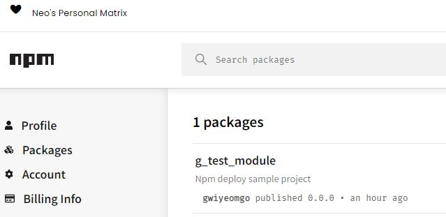

올해 초에 npm 모듈을 만드는 방법을 알게되었다
계속 시도해 보려고 하다가 제대로 코드를 완성하고 시도하는 것보다
test module 을 만들어서 올리기로 결심했다

### test 진행내용

1. 프로젝트 폴더 생성
=> g_test_module 이라는 폴더를 만들었다

2. `package.json` 을 생성
	- `npm init`실행

[내가 따라한 블로그의 글](https://kdydesign.github.io/2020/08/28/npm-tutorial/)에는
bin 이라는 폴더에 cli.js 를 파일을 넣었고
`log-run` 이라는 명령어를 입력해 cli.js 를 실행시 console에 메세지가 찍히는 프로그램이었다.

```
{
  "name": "g_test_module",
  "version": "0.0.0",
  "author": "gwiyeomgo",
  "bin": {
    "log-run": "bin/cli.js"
  },
  "license": "ISC",
  "keywords": [
    "sample"
  ],
  "files": [
    "cli"
  ],
  "description": "npm deploy sample project",
  "dependencies": {
    "commander": "^9.4.0"
  }
}
```

[이 글을](https://www.daleseo.com/js-npm-publish/)을 보면 꼭 위 형태처럼 안해도 될 거 같다
`package.json` 을 생성했을 때 `"main": "index.js",`와 같이 자동으로 생성된다
`index.js` 파일에 컴포넌트나 외부에서 사용하고싶은 내용을 써도 되는 거 같다

```
	module/
		├── README.md
        ├── index.js
        ├── .gitignore
        └── package.json
```

또한 어떤 글에서는 아래처럼 license 도 추가하더라
- `LICENSE.md`


우선 테스트이니 cli 명령어를 실행하는 내용을 따라했다

내 모듈 link: https://www.npmjs.com/package/g_test_module


..아 node_module 에 코드에 사용했던 module을 열어보니
lib 에 js 파일들이 있고
index.js 에서 특정 js 파일을 exports 해서 밖에서 쓸 수 있도록 할 수 있다

### 출처
[package.json 설명 글](https://heropy.blog/2018/02/18/node-js-npm/)

[적용 예시1](https://kdydesign.github.io/2020/08/28/npm-tutorial/)

[적용 예시2](https://www.daleseo.com/js-npm-publish/)

[적용 예시3](https://heropy.blog/2019/01/31/node-js-npm-module-publish/)

### 적용
사용자가 최신 배포된 버전의 js 파일을 볼 수 있도록 만


