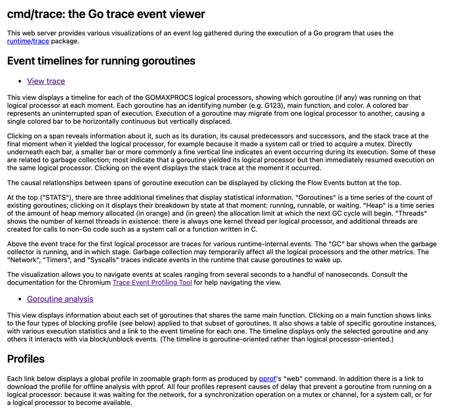

# 배경
인프라팀에서 자체적으로 apm 을 만들었고
실행결과 특정 서비스가 메모리를 많이 사용하고 있다고 알게되었다
고쳐야하는데
어디서 많이 누수가 발생하는지 모르겠다


[링크1](https://www.nylas.com/blog/finding-memory-leak-in-go-service-dev/)
를 통해 어디에서 메모리를 많이 사용할 수 있는지 알 수 잇다고 한다


# Profile 정보 수집
### (1) "net/http/pprof"
[http.HandleFunc 으로 핸들러를 구현한 경우](https://ssup2.github.io/programming/Golang_Profiling/?ref=pangyoalto.com)를 인터넷에서 봤고 지금사용하는
ehco 프레임워크에 적용하는 방법
`e.GET("/debug/pprof/*", echo.WrapHandler(http.DefaultServeMux))` 를 추가

>  Profile File 정보 얻기

CPU 정보
```
curl http://localhost:8080/debug/pprof/profile > profile.pprof
```
Memory Heap 정보
```
curl http://localhost:8080/debug/pprof/heap > heap.pprof
```

모든 HTTP Endpoint에 seconds Query String를 이용하면 몇 초 동안 Profiling을 수행할지 설정
```
 curl http://localhost:8080/debug/pprof/trace\?seconds\=30 --output trace.out
```

### (2) [다른방법들..](https://ssup2.github.io/programming/Golang_Profiling/?ref=pangyoalto.com)
`runtime/pprof Package` , `Unit Test` 등등..

# Profile 시각화 보기

pprof 도구로 profile 파일을 다운받기
`go tool pprof [-http옵션][Profile File]`

`go tool pprof heap.pprof`
`go tool pprof -http :8080 heap.pprof`
`go tool pprof http://0.0.0.0:8080/debug/pprof/heap`

커맨드를 사용해 시각화 해서 볼 수 있음
graphviz 그래프 기반의 dot 파일로 기술된 다양한 이미지를 쉽게 시각화할 수 있는 패키지
graphviz 설치해야 시각화된 정보를 얻을 수 있음

 - mac 에서 다운받기
`brew install graphviz`

command 에서 아래 명령어로 분석가능

`(prof) web`
커멘드 창에 web 을 입력시 web 에서 그래프를 볼 수 있음

`(pprof) png` => 이미지 생성해서 받을 수 있음
Generating report in profile001.png

`(pprof) top15`


1. 수집한 profile data 시각화

180초 동안 수집한 profile data 다운
`curl http://localhost:8080/debug/pprof/profile\?seconds\=180 --output profile.out`

`go tool pprof -http localhost:9090 profile.out`

=> 해당 명령을 실행하면 web 에서 view > top 에서  CPU 사용률이 높은 함수를 순서를 보여준다

2. 수집한 profile trace 보기

`curl http://localhost:8080/debug/pprof/trace\?seconds\=180 --output trace.out`
	9090 포트로 실행
`go tool trace -http localhost:9090 trace.out`


[링크2](https://pangyoalto.com/go-using-pprof-for-profiing/)


# 분석

### (Flat,cum )[https://ssup2.github.io/programming/Golang_Profiling/]

flat is duration spent on given a function and
cum is cumulative of current function plus calls above it

Flat은 함수가 직접적으로 수행하는 Action의 부하
Cum은 함수가 실행되기 위한 모든 Action의 부하


sum% could help you to identify the big rocks quickly. The following is another example of memory allocation report.
sum% = 메모리 사용률
메모리 사용률(sum) 이 100% 가 되지 않는 상황

누수는 프로그램이 더 이상 필요하지 않은 메모리를 해제하지 않아 발생하며, 이로 인해 메모리 사용량이 계속해서 증가..
https://stackoverflow.com/questions/32571396/pprof-and-golang-how-to-interpret-a-results
https://ssup2.github.io/programming/Golang_Profiling/

출력된 그래프를 읽는방법
https://github.com/google/pprof/blob/main/doc/README.md#interpreting-the-callgraph


--
질문.. 로컬에서는 실행해서 데이터를 확인했는데..
인프라 담당자분이 개발계 터미널에서 localhost 로 실행해서 파일을 생성했다


https://github.com/google/gops
https://pangyoalto.com/go-using-pprof-for-profiing/
https://ssup2.github.io/programming/Golang_Profiling/?ref=pangyoalto.com