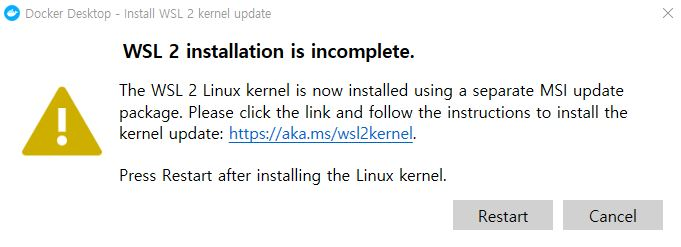

# 배경
(2021)
최근 관리자가 보는 admin을 개선하기 위해
오픈 소스로 만든 admin을 checkout 받아서 진행했다.
그 오픈 소스는 docker를 사용하는데 docker를 어떻게 쓰는건지 하나도 모르겠다.
docker에 관해서 조사하고 알게된 사실을 기록하려고 한다.
(2023)
mac 으로 pc 바꾸고.. 갑자기 토의프로젝트로 mac 에서 도커를 실행해서 카프카 컨테이너를 띄었다.
mac 에서 설치 방법을 추가한다

# docker?
* 배포와 운영을 쉽게 도와주는 플랫폼
* 서버 컨테이너 가상화 기술
* container 를 사용

> 가상화? 왜 docker 써야해? Why use Docker?
* 가상화 기술은 컴퓨터 안에 가상으로 또 다른 컴퓨터를 만들어서 여러 애플리케이션을 독립적으로 실행할 수 있게 하는 기술
* 서버의 자원을 최대한으로 활용함으로써 서버 급증 문제를 해결하기 위해 가상화 사용

> [docker vs VMware vs  VirualBox](https://cloudacademy.com/blog/docker-vs-virtual-machines-differences-you-should-know/)
* docker는 컨테이너 가상화 기술로, 기존 가상화 기술에 비해 더 가볍고 빠르며, 애플리케이션을 더 효율적으로 격리하여 실행

하이퍼바이저 ex) VMware vs  VirualBox
https://www.redhat.com/ko/topics/virtualization/what-is-a-hypervisor

>  이미지 vs 컨테이너 vs volumes
* 이미지
    - 컨테이너를 만드는 읽기 전용 템플릿
    - 컨테이너 실행에 필요한 파일과 설정값을 입력한 yml 파일을 빌드하여 이미지를 생성
    - 이미지는 도커를 통해 여러 사람과 공유할 수 있으며 `docker pull,docker search 이미지` 등으로 찾고 받을 수 있음

* Container(컨테이너)?
    - Container는 공유된 운영체제에서 격리되어 실행할 수 있는 형식으로 소프트웨어를 가상화하는 방법
    - 이미지를 실행한 상태 = 컨테이너 띄움

* [volumes](https://blog.naver.com/PostView.naver?blogId=oxcow119&logNo=222412860960&categoryNo=0&parentCategoryNo=0)
    - 컨테이너와 호스트 컴퓨터 간에 데이터를 공유하고 저장하는 방법
    - 컨테이너가 종료되더라도 데이터가 유지
    - 볼륨을 사용하면 데이터를 영구적으로 보존하고 여러 컨테이너 간에 공유할 수 있습니다.

ex) 볼륨 없이 Kafka 컨테이너를 실행하면
볼륨없이 실행하면 모든 데이터는 컨테이너 내부에 저장되며  컨테이너를 종료하거나 삭제하면 저장된 모든 데이터가 사라지게 됩니다.
볼륨을 사용하여 Kafka 컨테이너를 실행하면 Kafka의 데이터와 설정 파일을 호스트 컴퓨터와 공유할 수 있습니다.
이를 통해 컨테이너를 업데이트하거나 재시작해도 데이터는 유지됩니다.

> 도커 이미지 생성 vs 도커 컴포즈
도커 이미지 생성은 개별 컨테이너를 준비하고 패키징하는 작업이며,
도커 컴포즈는 다수의 컨테이너로 구성된 애플리케이션을 정의하고 실행하기 위한 도구

* 도커 이미지 생성:
    - Dockerfile 사용해서 이미지를 빌드하고 단일 컨테이너를 실행(개별 컨테이너의 환경 및 소프트웨어를 정의하고 빌드)
    - `docker build`

* 도커 컴포즈 :
    - 여러 개의 도커 컨테이너를 정의하고 구성하는 도구
    - 다수의 컨테이너 간의 관계, 네트워크 설정, 볼륨 공유 등을 관리
    - `docker-compose` 명령

> 로컬 환경에서 도커 사용 vs 가상 머신 환경에서 도커 사용
개발 및 테스트 목적으로는 로컬 환경이 편리하고 비용 효율적일 수 있으며, 프로덕션 환경에서는 VM 또는 클라우드 환경에서의 도커 사용이 더 적합

    - 로컬 환경에서 도커 사용 : 개발자들은 로컬 환경에서 도커 컨테이너를 실행하여 애플리케이션을 개발하고 테스트하는 데 사용,개인 프로젝트
    - 가상 머신 환경에서 도커 사용 :
    대규모 애플리케이션을 운영하거나 복잡한 서버 환경,
    클라우드 서비스 제공 업체들은 VM 인스턴스 내에서 도커를 실행

* 참고
[AWS ElasticBeanstaclk  올린다](https://docs.aws.amazon.com/ko_kr/elasticbeanstalk/latest/dg/create_deploy_docker.html)
ElasticBeanstaclk = 도커 컨테이너에서 웹 애플리케이션의 배포를 지원

___
# mac m2
> 도커 설치

`brew update`
`brew search docker`
`brew install --cask docker`
    *  m2 mac 에서는 해당 명령어로 도커 설치시 arm64 로 설치되었다.
`docker -v`
    * 버전이 확인되면 내 컴퓨터에 설치가 완료됨

> 도커 실행
mac 에서 다운받았는데
docker desktop 을 어플리케이션으로 실행하고 로그인 했다
personal 은 무료인거 같다.
https://www.daleseo.com/docker-run/
https://www.docker.com/pricing/

> 실행중인 이미지 중지

ㅎㅎ 도커에 카프카랑 주키퍼 다운받고 실행시켰다가 ui에서 삭제해서 port 가 종료가 안되는 오류가 있었다
결국 컴퓨터를 다시 시작했고
그이후부터는 yml 파일을 다시 돌릴때는 기존에

상태 확인 =`docker ps`
컨테이너 중지 = `docker stop {containerID}`
컨테이너 삭제 =`docker rm {containerID}`

이렇게하니 제대로 종료되어서 재설치시 포트 중복 문제는 없어졌다

> 도커 삭제
`brew uninstall docker`
`brew uninstall docker-compose`

> 도커 캐쉬 삭제
` sudo docker system prune -a`
https://shawn-dev.oopy.io/aac3acd7-f314-40cf-93f5-fe4e2ae628ea

___
# Window10 도커 설치

1. 가상화 기술인 Hyper-V를 활성화
(작업 관리자에서 가상화를 사용함으로 설정했는지 확인)
키보드의 'Ctrl + Shift + Esc'를 누르면 작업 관리자

제어판 > 프로그램 설치 및 제거 > Window 기능 켜기/끄기 클릭 > Hyper-V 체크 확인 후 리부팅

2. Docker 설치
> [설치링크](https://hub.docker.com/editions/community/docker-ce-desktop-windows/)를 클릭> Get Docker 버튼 클릭 >

WSL은 윈도우에서 경량 가상화 기술을 사용해 리눅스를 구동할 수 있도록 도와주는 기능입니다. [WSL2](https://www.44bits.io/ko/post/wsl2-install-and-basic-usage)는 WSL을 대폭 개선해 훨씬 더 뛰어난 성능과 통합된 환경을 이용할 수 있습니다

이 항목은 언제든지 설치 후에도 바꿀 수 있으니 그냥 넘어 간다.

\>설치중\>Close and restart 클릭 \>재부팅 후

본다면 링크가서 `x64 머신용 최신 WSL2 Linux 커널 업데이트 패키지`클릭
[https://docs.microsoft.com/ko-kr/windows/wsl/install-win10#step-4---download-the-linux-kernel-update-package](https://docs.microsoft.com/ko-kr/windows/wsl/install-win10#step-4---download-the-linux-kernel-update-package)

 3. Docker Sign in or Sign Up

free 로 가입함

 4. CMD에서 설치 확인 `docker -v`

___

https://wooono.tistory.com/123
https://www.daleseo.com/docker-compose/